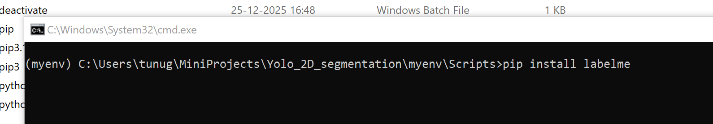
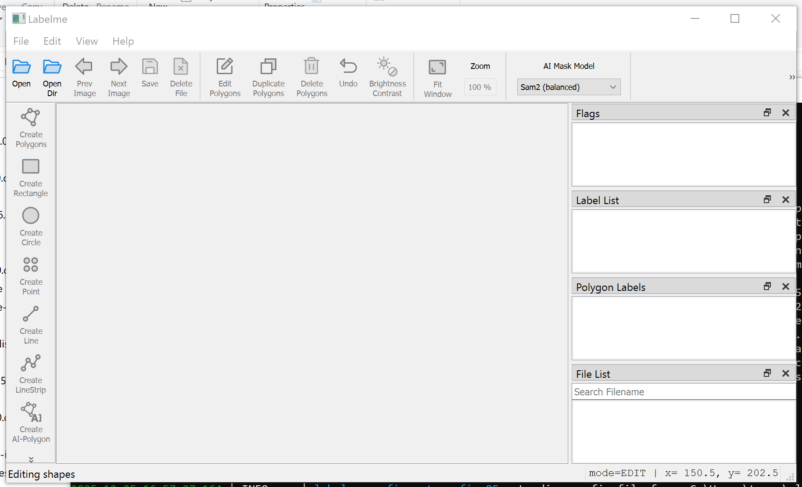
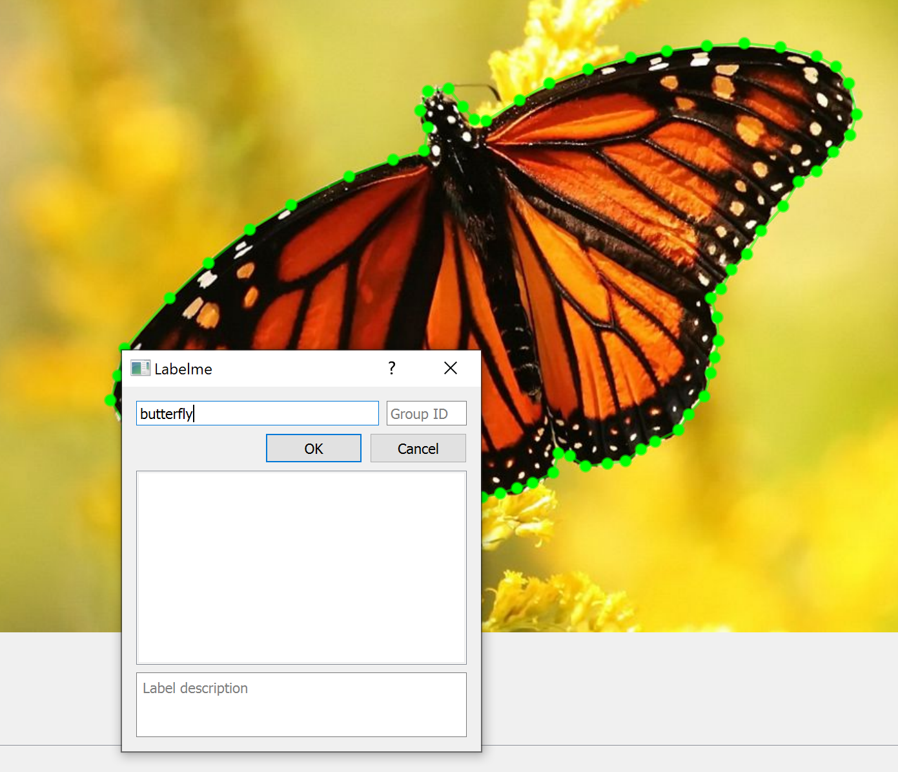
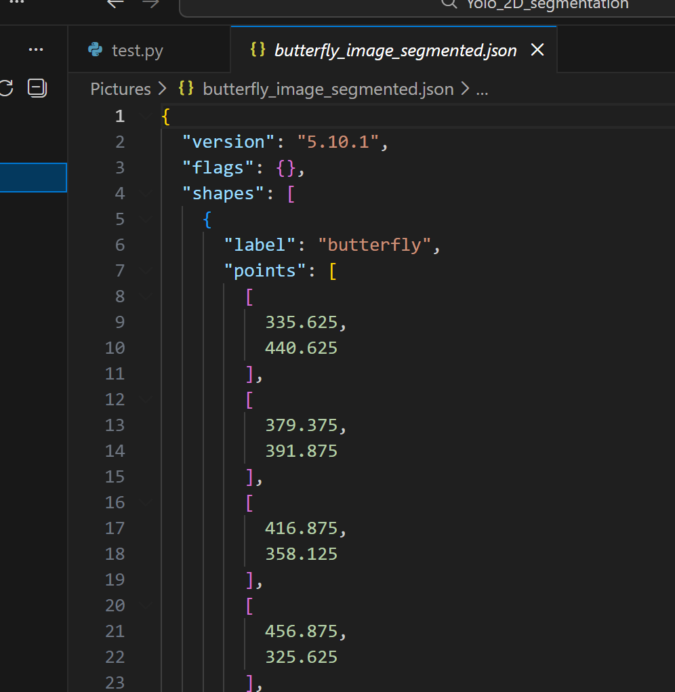
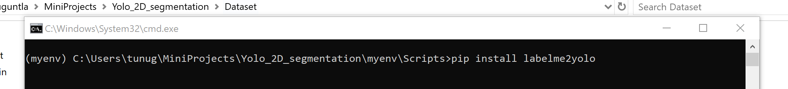
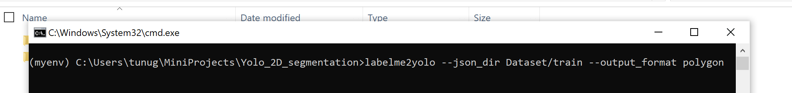
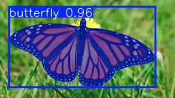

# Yolo_2D_Segmentation

This project demonstrates the capabilities of the YOLO model for real-time instance segmentation. Specifically, the YOLOv8m architecture is trained on a custom [dataset](https://github.com/ayoolaolafenwa/PixelLib/releases) to evaluate its performance in accurately detecting and segmenting objects under application-specific conditions.

The project documentation outlines the complete workflow adopted in this study, including:

<ul> 
  <li>generation of segmentation annotations for ground truth labels</li> 
  <li>preprocessing of the image and corresponding label datasets</li> 
  <li>training of the YOLO-based segmentation model</li> 
  <li>quantitative and qualitative evaluation of the trained model.</li> 
</ul>

<h2>Dataset Preparation</h2> 

 The objective of this project is to detect butterflies in images and generate precise instance-level segmentation masks delineating their boundaries. The dataset comprises a diverse collection of butterfly images captured under varying orientations, scales, and visual conditions.
 

The figures below illustrate a representative sample from the image dataset used for generating segmentation annotations. 

  
  
  
  

 The Python package manager (<code>pip</code>) provides access to the annotation tool <b>LabelMe</b>, which is used to create ground truth annotations and associate semantic labels with each image. The tool generates a structured JSON file that stores the polygon coordinates defining the segmentation mask, along with the corresponding class label. 
 

 The figure below illustrates the command used to install the <i>LabelMe</i> annotation tool via <code>pip</code>. 

  

 The annotation tool is then used to generate ground truth data for the image dataset. The images are loaded by specifying the paths to the <b>input</b> and <b>output</b> directories via the <b>File</b> menu. Polygonal segmentation masks are manually drawn around the object of interest—specifically, the butterfly using the <b>Create Polygon</b> option. 
  

  

 Once a closed polygon is completed, a corresponding class label can be assigned to the annotated object. 

  

 For each annotated image, a JSON file is automatically generated, containing the associated label information and the normalized coordinates of the segmentation mask. The screenshot below illustrates an example of the generated annotation data. 

  

 It is important to note that the manual generation of ground truth annotations is a time-intensive process that requires significant attention to detail. Furthermore, the JSON files produced by <i>LabelMe</i> are not directly compatible with the YOLO training pipeline. To address this limitation, the Python <code>pip</code> ecosystem provides an additional conversion utility, <b>labelme2yolo</b>. 

 The <b>labelme2yolo</b> tool converts the annotation data into YOLO-compatible text files, enabling their use in both object detection and instance segmentation tasks. The figure below illustrates the command used to install the <i>labelme2yolo</i> package via <code>pip</code>. 

  

 The label and ground truth coordinate files are generated using the following command: 

  

 It should be noted that the <b>--output_format=polygon</b> argument is required to produce annotation files suitable for segmentation tasks. By default, the tool generates output formatted for object detection only and does not include polygon-based segmentation information. 

 This concludes the dataset preparation phase. The YOLO model can now be downloaded and trained using the custom-prepared dataset. 

<h2>YOLO Training</h2>

The <b>YOLOv8m-seg</b> architecture is employed in this project to detect the presence of butterflies and generate corresponding instance-level segmentation masks for each detected object.

The file paths for the training and validation image datasets are specified and managed through a YAML configuration file, ensuring a structured and reproducible training setup.

The table below summarizes the key software libraries installed and used for training the model.

| Library  | Description |
| ------------- | ------------- |
| Ultralytics  | Ultralytics provides the instance to download the YOLO model and the arguments necessary to initiate the training |
| Pytorch  | Pytorch provides the backbone framework to support the YOLO training  |

Although the Ultralytics framework automatically installs the required PyTorch dependencies, the default installation does not include CUDA support for GPU acceleration. As a result, the model may be restricted to CPU-based training unless additional configuration is performed.

To enable GPU-accelerated training, it is therefore recommended to install PyTorch directly from the [official homepage](https://pytorch.org/get-started/locally/). This installation provides the necessary CUDA support, allowing the model to leverage available GPU resources and significantly reduce training time.

The table below provides the information on training parameters:

| Parameter  | Value |
| ------------- | ------------- |
| task  | segment  |
| mode  | train |
| epochs  | 100 |
| batch size | 8  |
| imgsz  | 640 |

The table below presents the number of samples used for training and validation, providing insight into the dataset distribution.

| Mode  | Number of samples |
| ------------- | ------------- |
| Training  | 300  |
| Validation  | 100 |

Upon successful completion of the training process, the pretrained model checkpoints <i>best.pt</i> and <i>last.pt</i> are generated in the <i>runs</i> directory, along with additional training logs and performance metrics. Model evaluation is conducted using the <i>best.pt</i> checkpoint, which corresponds to the model state that achieved the highest validation performance.

<h2>YOLO Inferencing</h2>

 This section presents the inference results produced by the model trained on the custom dataset. The trained YOLOv8 segmentation model is evaluated using both still images and video sequences to assess its detection and segmentation performance under different input modalities. 

<h3>Inference using an image</h3>

 The image shown below is provided as input to the YOLO model during the inference phase. 

  

 The corresponding prediction generated by the network is illustrated below. The model successfully identifies the object of interest by producing a bounding box and an associated instance segmentation mask, along with the predicted confidence score. 

  

 In addition to image-based evaluation, the detector is assessed using a video sequence. The output video generated by the YOLO model is shown below. 

https://github.com/user-attachments/assets/b09968ec-8597-4cf6-970e-667d41356fdd

 The model demonstrates the ability to detect and segment multiple butterflies within a single frame. The resulting video output highlights the efficiency of the detector in handling multiple instances simultaneously. 

https://github.com/user-attachments/assets/c51eb9cf-f44c-4caa-b2d0-7160558f6bf0

<h2>References</h2>
<ol>
  <li>Dataset: https://github.com/ayoolaolafenwa/PixelLib/releases</li>
  <li>Youtube tutorial: https://youtu.be/DMRlOWfRBKU?si=pDfLNM-utDjEmnFV</li>
</ol>
